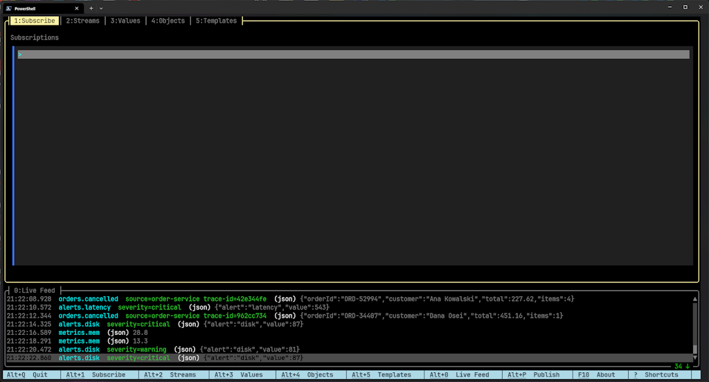
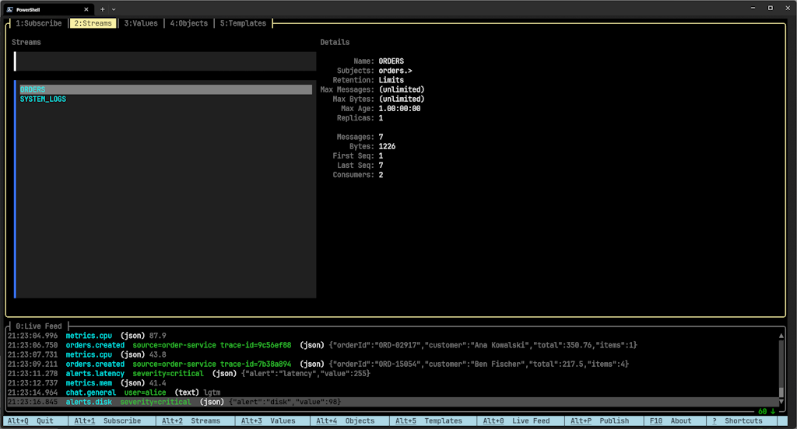
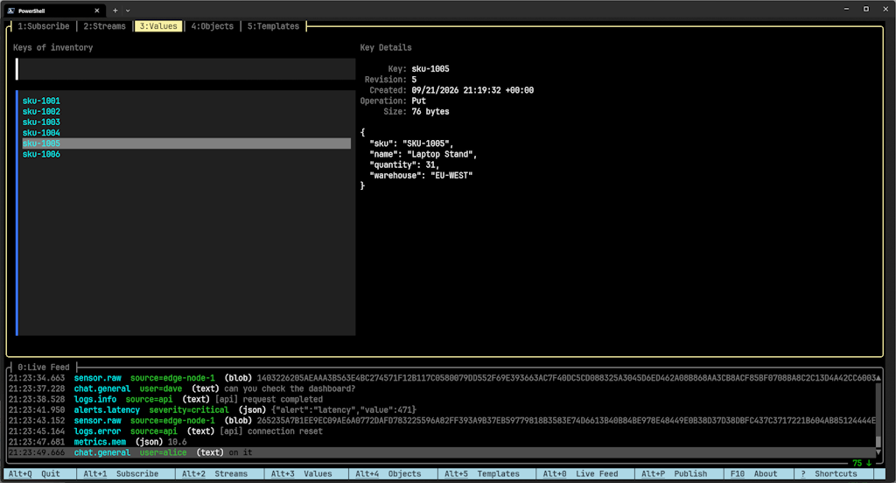
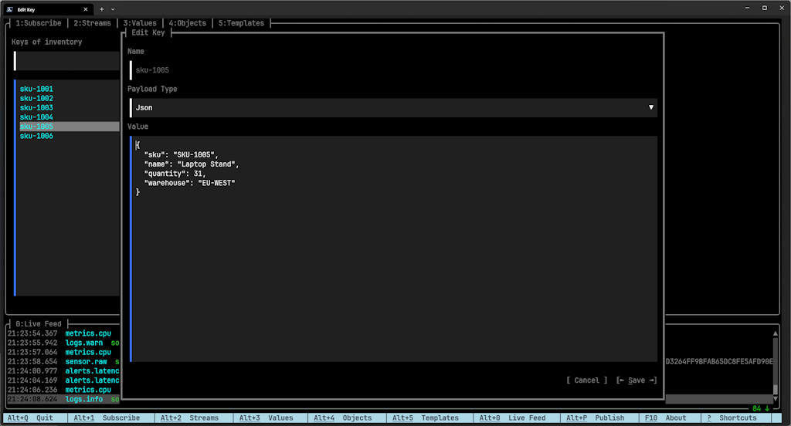
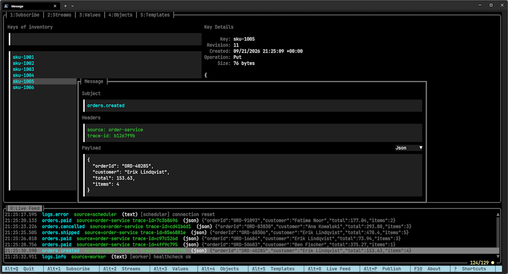
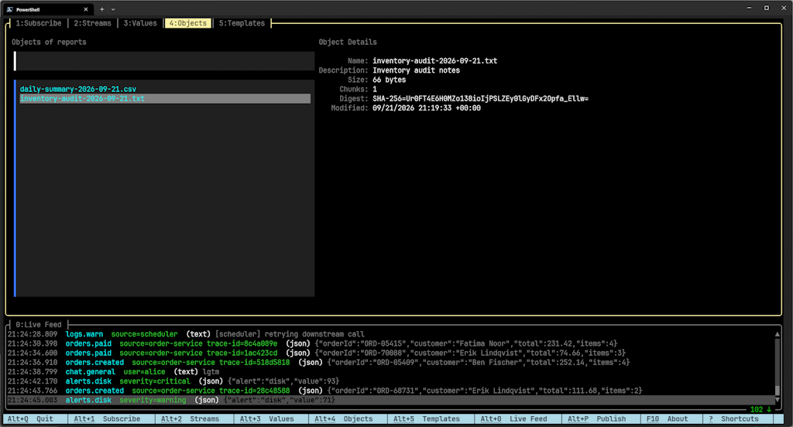
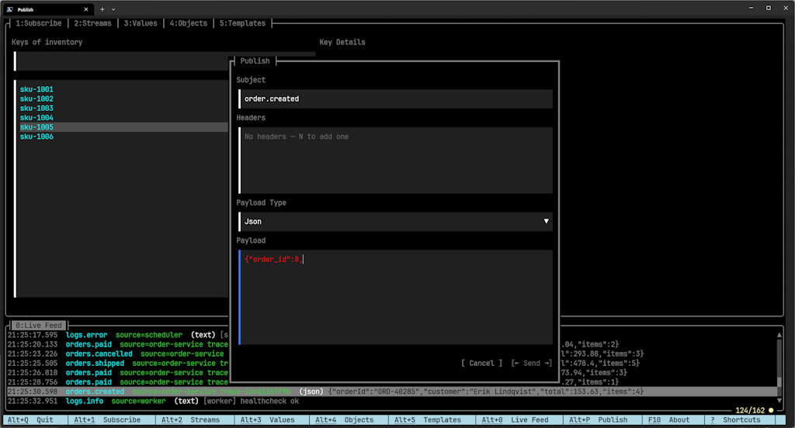

# lazynats

A fast, keyboard-driven terminal UI for [NATS](https://nats.io), in the spirit of `lazygit` /
`lazydocker`. Watch a live message feed, browse and manage JetStream streams/consumers, KV
buckets and object stores, and publish messages - all without leaving the terminal.

## Why

Working with NATS day to day usually means juggling several `nats` CLI invocations in different
panes (`nats sub`, `nats stream info`, `nats kv get`, ...) or reaching for a browser-based admin
tool that doesn't fit a terminal workflow. lazynats gives you one screen that stays open: a live
feed of traffic at the bottom, and tabs for drilling into streams, KV/object stores and
subscriptions on top, all reachable with a handful of keystrokes and no mouse required.

## Features

- **Live feed** - subscribe to one or more subjects and watch messages arrive in real time, with
  per-message payload-type-aware rendering (JSON, text, binary) and a detail view for headers and
  raw payload.
- **Streams** - list JetStream streams, drill into a stream's consumers, see live message/pending
  counts, delete streams/consumers.
- **Values (KV)** - browse KV buckets and their keys, view/edit values, watch revisions update
  live.
- **Objects (OBJ)** - browse object stores and their entries (size, chunks, digest, modified).
- **Publish** - compose and send a message (subject, headers, payload) from a modal dialog reachable
  from anywhere.
- **Message templates** - save frequently-sent messages and reuse them from the Publish dialog.

See [`doc/UI.md`](./doc/UI.md) for the fuller design write-up.

## Screenshots

| | |
|---|---|
|  Subscribe tab: pattern list on top, live feed of matching messages below |  Streams tab: stream list with live details (limits, message/consumer counts) |
|  Values tab: keys in a KV bucket with the selected key's details and JSON value |  Editing a KV entry's value in place |
|  Drilling into a single feed message's subject, headers and payload |  Objects tab: entries in an object store bucket with size/digest details |
|  Publish dialog: subject, headers and payload, reachable from anywhere via Alt+P | |

## Installing

Prebuilt, self-contained (no .NET runtime needed) binaries for Windows, Linux (x64/arm64) and
macOS (arm64) are published on the
[Releases page](https://github.com/MiloszKrajewski/lazynats/releases). Download the zip for your
platform, extract it, and run the `lazynats` executable.

Alternatively, build from source (see below).

## Usage

lazynats connects to a NATS server at `nats://localhost:4222` by default. Point it elsewhere with
`-s`, or set `NATS_URL`:

```shell
lazynats -s nats://my-server:4222
```

Authentication (username/password or token), also available via `NATS_USER` / `NATS_PASSWORD` /
`NATS_TOKEN`:

```shell
lazynats -s nats://my-server:4222 -u myuser -p mypass
lazynats -s nats://my-server:4222 -t mytoken
```

Command-line options, once given, take full control of authentication - no partial top-up from
leftover environment variables.

Once running, press `?` to see all keyboard shortcuts for the current view (they're
context-sensitive - a status bar at the bottom always shows what's available). A few global ones:

| Key | Action |
|---|---|
| `?` | Show all keyboard shortcuts |
| `Alt+1` .. `Alt+5` | Switch management tab (Subscribe / Streams / Values / Objects / Templates) |
| `Alt+0` | Jump to the Live Feed |
| `Alt+P` | Open the Publish dialog |
| `F10` | About (build/version info) |
| `Ctrl+R` | Refresh the current list |
| `Esc` | Back / close |

## Building from source

Requires the .NET SDK version pinned in [`global.json`](./global.json).

```shell
dotnet run --project src/lazynats     # run against a NATS server at nats://localhost:4222
dotnet build src/lazynats.sln         # compile only
dotnet test src/lazynats.sln          # run unit tests
```

`./build.ps1` / `./build.sh` drive the full CI/release pipeline (clean, restore, build, test,
platform-specific AOT publish) if you want a release-equivalent local build.

## License

[MIT](./LICENSE)
